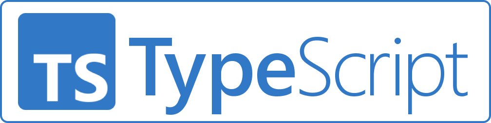

<aside>
<p>参与编写：Pi圆周率</p>
<p>开始编写时间：2023年1月17日</p>
<p>编写完成时间：2023年1月18日</p>
<p>最后一次修改：2023年1月18日</p>
</aside>

识时务者为俊杰，我们也来看看其他语言。

P.S. 下面的语言是我认为比较“优秀”的编程语言，还有一些没有讲到的，可以百度一下

认识一门语言，按惯例要从输出Hello World开始。
让我们从不同语言的Hello World出发

```python
# Python
print("Hello World")
```

## 0x1 C家族

```c
// C
#include <stdio.h>
int main(int argc, char* argv[])
{
    printf("Hello World\n");
    return 0;
}
```
```c++
// C++
#include <iostream>
using namespace std;
int main(){
    cout << "Hello World" << endl;
    return 0;
}
```
```c#
// C#
namespace hello{
    internal class Hello{
        static void Main(strings[] args){
            Console.WriteLine("Hello World");
        }
    }
}
// Or more simpler, just
Console.WriteLine("Hello World");
```
```oc
// Objective-C
#import <Foundation/Foundation.h>
int main()
{
    NSLog(@"Hello World");
    return 0;    
}
```

C语言有着一个庞大的家族，
这个家庭的成员有：C语言、C++（俗名C艹）、
C#（念C Sharp）、OC（Objective-C）

我为什么要把它们放在一起讲呢？因为它们都很像。

一般的，这些语言有以下优点：

1. 比较“基层”，运行速度较快
2. 学好一门，上手另一门很快

| 名字  |                                                    官网链接                                                    |
|:---:|:----------------------------------------------------------------------------------------------------------:|
|  C  |                                                     无*                                                     |
| C++ |                                                     无*                                                     |
| C#  | [https://dotnet.microsoft.com/zh-cn/languages/csharp](https://dotnet.microsoft.com/zh-cn/languages/csharp) |
| OC  |                                                     无*                                                     |

<p>* 由于年代古老，标星号的语言都没有官网，上表中所有的语言都没有官方的Logo</p>

## 0x2 Java

<aside>

<p><a href="https://www.java.com/zh-CN/">Java官网</a></p>
</aside>

```java
// Java
public class Hello{
    public static void main(String[] argv){
        System.out.println("Hello world");
    }
}
```

在我的印象里，听别人提起过最多次的编程语言就是Java。

Java有以下优点：

1. 安全性能高
2. 强制类型，健壮性强

## 0x3 Go

<aside>

<p><a href="https://go.dev/">Golang的官网</a></p>
</aside>

```go
// Go
package main
import "fmt"

func main(){
    fmt.Println("Hello World")
}
```

Go（也叫Golang）是一门比较新的语言，几乎和Python一样优雅，与Python的语法也类似，
使用的人也很多，值得一学。顺带说一句，Golang的吉祥物是囊地鼠（见右图），
很多Go的项目都会往封面上加上这个萌萌的吉祥物。

## 0x4 Rust

<aside>

<p><a href="https://www.rust-lang.org/zh-CN/">Rust的官网</a></p>
</aside>

```rust
// Rust
fn main() {
    println!("Hello World");
}
```

Rust与C语言家族是“近亲”，这门语言相当“基层”，
你可以在手肝操作系统的教程里看到它的身影；
（从右边的Logo中也可以看出来这一特点）
它的另一大特点就是安全，任何不安全的代码都无法成功编译
（不过好像有个unsafe语句块可以解决）。
也很值得学一学。

## 0x5 JavaScript家族
```javascript
// JavaScript
alert("Hello World")
```

如果你想要开发网站，那么JavaScript就是你的必学内容。
JavaScript虽然名字里有个Java，但和Java没有半点关系。
JavaScript的一大特点是自由开放，这段代码你想怎么写就这么写，
没有特别严格的要求（不过你要是严于律己的话，可以使用"use strict"）。

当然，由于JavaScript中一些特性实在是奇怪，于是出现了其他奇怪的东西，
比如这个：[JSF*ck - 只用6种字符编写你的代码](http://www.jsfuck.com/).

JavaScript的其他原因也导致了一些替代品的出现：
JSX语法、TypeScript、CoffeeScript等

|      名称      |                      Logo                       |                                    官网                                    |
|:------------:|:-----------------------------------------------:|:------------------------------------------------------------------------:|
|  TypeScript  |  | [https://www.typescriptlang.org/zh/](https://www.typescriptlang.org/zh/) |
| CoffeeScript |  |          [https://coffeescript.org/](https://coffeescript.org/)          |

