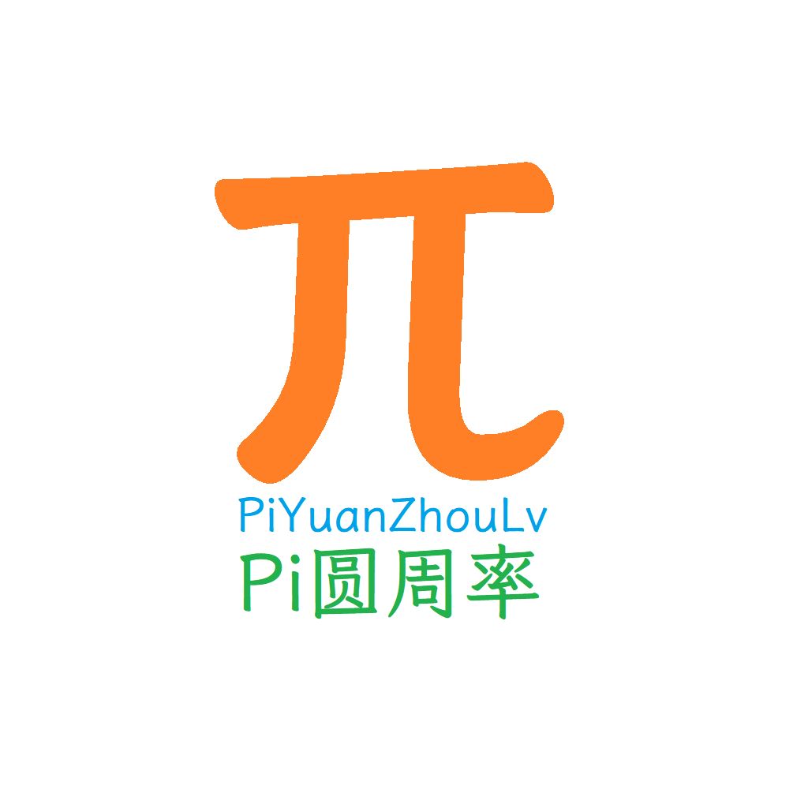

%Cover%

> 复制后可运行 %CopyButton%

## 序

这是我编写的第二本书(第一本是同时编写的《电教员进修指南》)。
编写这本书的缘由也很简单——我的第三个徒弟拿着一本编程书来问我怎么看，
我翻了翻，血压飙升，跟他讲，这本书不太好，我去帮你编一个目录。
后来吧，又仔细地看了看，血压更高了。

> 我：“这本书\*\*的是考古的人写的吧！
> 去盗秦始皇的墓，发现里面收藏了一大堆三叶虫化石，
> 回来激动的不得了，才编的吧！
> 我\*\*的真要谢谢他，编这种东西干什么，
> 祸国殃民，教坏小朋友，赶紧快\*\*的丢掉
> 该讲的没讲，不该这么早讲的偏偏要讲，
> 我\*他妈，\*你妈，退钱……（省略亿字）”

算了，不讲了，越讲越气。

然后我就开始编写这本书。这本书的名字很明显，是“从入门到精通”的变种。
我想用“入门到精通”来蹭一波热度(就像上文提及的那本垃圾一样)，
但又怕写的不好侮辱了这个名字，所以就改成了“从入门到入坟”，
既是一种自嘲，也是对读者能够“终身学习”的希望。

书怎么样，谁读谁知道。

本书分为五章，其中第一章作为一个简介和导入，不设考点，了解一下就行；
第二、三、四章是正式内容，每一章后有一个结业测试，形式为根据提示补全代码，
完成后可以获得对应“结业证书”一份 <del>可能除了炫耀外没啥用</del> ，可以作为完成课程装逼用的凭证；
第五章是选修内容，可以选择一个或几个内容学习，结业测试为自由编写一个小程序，不设标准，
 <del>不写都可以</del> 会与证书一同保存，一同作为完成了全书学习的凭证。

如果您在阅读过程中发现了错误，请您先检查一下您是不是使用的是最新版。
若最新版仍有问题，您可以在Github上新建issue，或者发邮件给我。
我的邮箱地址是：PiYuanZhouLv@outlook.com。
如果您也想参与本书的编写，我表示热烈欢迎。您可以用上面的任意一种来与我取得联系。
不管您是大佬还是菜鸡，都可以来参加本书的编写！（当然，摸鱼、水稿、瞎搞者除外）

最后，祝大家学习愉快！

编者 PiYuanZhouLv

写于 2023年1月1日

<nav style="text-align: left">
    <a href="%E4%B8%80%E3%80%81Python%E7%9A%84%E6%98%A8%E5%A4%A9%E3%80%81%E4%BB%8A%E5%A4%A9%E5%92%8C%E6%98%8E%E5%A4%A9/%E7%AB%A0%E9%A6%96.html" title="一、Python的昨天、今天和明天"><button>开始阅读</button></a>
    <a href="#ContentTable" title="目录"><button>转至目录</button></a>
</nav>

## 作者简介

### Pi圆周率(PiYuanZhouLv)

<aside>

</aside>

本教程的发起人、作者，高中生，有过3年电教员经验、2.5年编程经验。

标签：

* 理工男？

* 真·电教员

* 文科《挂科王》主编 (书是虚构的，现实是残酷的……)

成就：

* 在Python编程上有所造诣

* 编有课程表等小程序

* 过了全国计算机等级考试二级(Python语言程序设计)

### 你

标签：

<ul>
<li contenteditable="true">(可编辑)</li>
<li contenteditable="true">(该内容不会保存)</li>
<li contenteditable="true">(亦不会上传)</li>
</ul>

成就：

<ul>
<li contenteditable="true">(可编辑)</li>
<li contenteditable="true">(该内容不会保存)</li>
<li contenteditable="true">(亦不会上传)</li>
</ul>

作为读者的你，也可以为本教程献出一份力！
你可以将本教程的错误提出、也可以给予编写建议、还可以协助编写！
我们欢迎您来[大展身手](https://github.com/PiYuanZhouLv/LearningPythonFromANoobToYourTomb)！

还等什么，开始阅读吧！

%ContentTable%